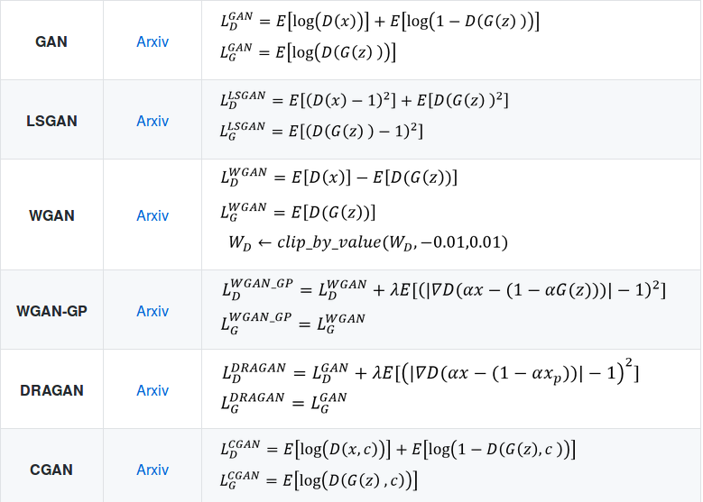
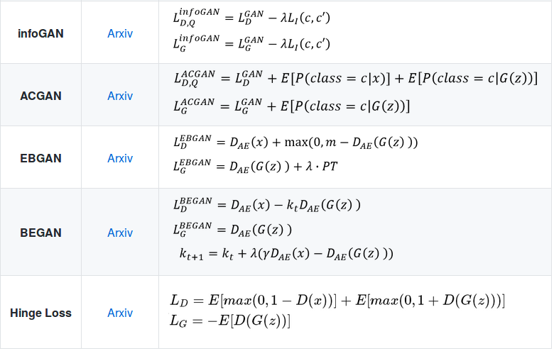

# GAN Objective Functions: GANs and Their Variations





## TF 代码分析

**Discriminator 损失**

```python
def discriminator_loss(loss_func, real, fake):
    real_loss = 0
    fake_loss = 0
    
    if loss_func.__contains__('wgan'):
        real_loss = tf.reduce_mean(real)
        fake_loss = -tf.reduce_mean(fake)
        
    if loss_func == 'lsgan':
        real_loss = tf.reduce_mean(tf.squared_difference(real, 1.0))
        fake_loss = tf.reduce_mean(tf.square(fake))
        
    if loss_func == 'gan' or loss_func == 'dragan':
        real_loss = tf.reduce_mean(tf.nn.sigmoid_cross_entropy_with_logits(labels=tf.ones_like(real), logits=real))
        fake_loss = tf.reduce_mean(tf.nn.sigmoid_cross_entropy_with_logits(labels=tf.zeros_like(fake), logits=fake))
        
    if loss_func == 'hinge':
        real_loss = tf.reduce_mean(relu(1.0 - real))
        fake_loss = tf.reduce_mean(relu(1.0 + fake))
        
    loss = real_loss + fake_loss
    
    return loss
```

**Generator损失**

```python
def generator_loss(loss_func, fake):
    fake_loss = 0
    
    if loss_func.__contains__('wgan'):
        fake_loss = -tf.reduce_mean(fake)
        
    if loss_func == 'lsgan':
        fake_loss = tf.reduce_mean(tf.squared_difference(fake, 1.0))
        
    if loss_func == 'gan' or loss_func == 'dragan':
        fake_loss = tf.reduce_mean(tf.nn.sigmoid_cross_entropy_with_logits(labels=tf.ones_like(fake), logits=fake))
        
    if loss_func == 'hinge':
        fake_loss = -tf.reduce_mean(fake)
        
    loss = fake_loss
    
    return loss
```

**梯度惩罚损失**

```python
def gradient_penalty(real, fake):
    if gan_type == 'dragan':
        shape = tf.shape(real)
        eps = tf.random_uniform(shape=shape, minval=0., maxval=1.)
        x_mean, x_var = tf.nn.moments(real, axes=[0, 1, 2, 3])
        x_std = tf.sqrt(x_var)  # magnitude of noise decides the size of local region
        noise = 0.5 * x_std * eps  # delta in paper
        # Author suggested U[0,1] in original paper, but he admitted it is bug in github
        # (https://github.com/kodalinaveen3/DRAGAN). It should be two-sided.
        alpha = tf.random_uniform(shape=[shape[0], 1, 1, 1], minval=-1., maxval=1.)
        interpolated = tf.clip_by_value(real + alpha * noise, -1., 1.)  # x_hat should be in the space of X
    else:
        alpha = tf.random_uniform(shape=[self.batch_size, 1, 1, 1], minval=0., maxval=1.)
        interpolated = alpha * real + (1. - alpha) * fake
        
    logit = self.discriminator(interpolated, reuse=True)
    grad = tf.gradients(logit, interpolated)[0]  # gradient of D(interpolated)
    grad_norm = tf.norm(flatten(grad), axis=1)  # l2 norm
    GP = 0
    # WGAN - LP
    if gan_type == 'wgan-lp':
        GP = self.ld * tf.reduce_mean(tf.square(tf.maximum(0.0, grad_norm - 1.)))
    elif gan_type == 'wgan-gp' or self.gan_type == 'dragan':
        GP = self.ld * tf.reduce_mean(tf.square(grad_norm - 1.))
    return GP
```

