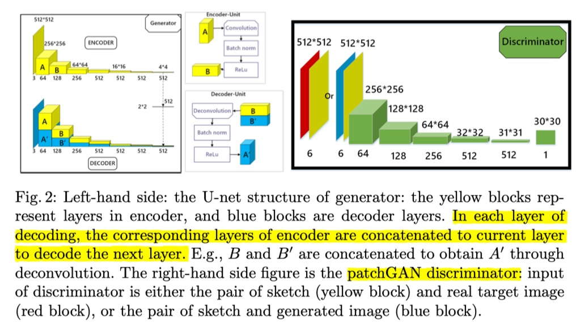
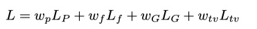
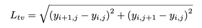
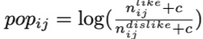
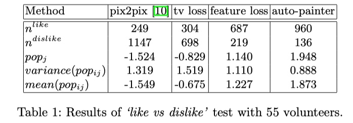
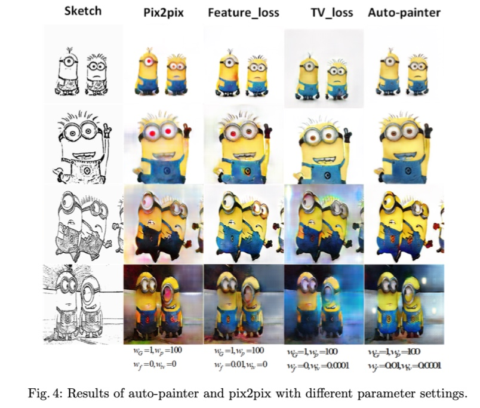

1. [Auto-painter: Cartoon Image Generation from Sketch by Using Conditional Generative Adversarial Networks](#1-auto-painter-cartoon-image-generation-from-sketch-by-using-conditional-generative-adversarial-networks)

2. [Semantic Image Synthesis with Spatially-Adaptive Normalization](#2-semantic-image-synthesis-with-spatially-adaptive-normalization)

   

## 1. Auto-painter: Cartoon Image Generation from Sketch by Using Conditional Generative Adversarial Networks

### Issue

- As the photo-realistic images are full of sharp details, the results may suffer from being wobbly

- The outputs of the network are hard to be controlled because the generator samples from a random vector in low dimension and the model has too much freedom

  

### Solution

- sketch-to-image synthesis problem by using conditional generative adversarial networks (cGAN)（利用 cGAN 给卡通素描上色）

- Constraints including ***total variance loss, pixel loss and feature loss*** are used in training the generator in order to generate more artistic color collocations

  

### Network Structure

### Loss Function

The loss function ensures that the generated image contains both pixel level details of sketch as well as high-level information of painted colors:

- L_G is the generative loss

- L_p is the pixel-level loss (the L1 distance between the generate image and the ground

  truth at pixel level)

- L_f is the feature loss (the L2 distance beteen outputs of the 4th layer of the VGG16 pre-trained on the ImageNet dataset)

- L_tv is the total variation loss (constrain the pixel changes in the generated results and encourages smoothness)

  

### Experimental Studies

#### Dataset

1. Training images are all resized to 512 × 512
2. Boundary detection filter XDoG to extract sketches

#### Evaluation Metrics & Results

1. Volunteers were presented with a series of painted images generated by different algorithms and asked to choose the best one and the worst one. Popularity index (based on the number of subjects who choose ‘like(dislike)’), for the i th picture generated by the j th algorithm:

   

   Result comparisons of the **pix2pix model, pix2pix +tv loss, pix2pix +feature loss and the auto-painter**:

   

2. Visualization

### Conclusion

1. U-net 的好处：

   Pure encoder-decoder network (the input goes through a series of down sampling steps to a lower dimension, then gets some non-liner transformation with a fully connected layer, and finally gets up sampling to the present output size) may cause information loss when passing through layers. **So ‘U-net’ , by concatenating layers in encoder to the corresponding layers of decoder, could maintain a certain degree of input sketch informaton and trained color painting information.**

2. 各种 loss 的作用：

   Compared with the Pix2pix model which has no feature loss and total variation (tv) loss, we could concluse that **without tv loss, the result images tend to dissolve to background and look messy（上图第三列和第五列）and without the feature loss, the details of result image become blurry（上图第四列和第五列）.**

------

## 2. Semantic Image Synthesis with Spatially-Adaptive Normalization

