1. [Auto-painter: Cartoon Image Generation from Sketch by Using Conditional Generative Adversarial Networks](#1-auto-painter-cartoon-image-generation-from-sketch-by-using-conditional-generative-adversarial-networks)
2. [Semantic Image Synthesis with Spatially-Adaptive Normalization](#2-semantic-image-synthesis-with-spatially-adaptive-normalization)

------

## 1. Auto-painter: Cartoon Image Generation from Sketch by Using Conditional Generative Adversarial Networks

### Issue

- As the photo-realistic images are full of sharp details, the results may suffer from being wobbly

- The outputs of the network are hard to be controlled because the generator samples from a random vector in low dimension and the model has too much freedom

  

### Solution

- sketch-to-image synthesis problem by using conditional generative adversarial networks (cGAN)（利用 cGAN 给卡通素描上色）

- Constraints including ***total variance loss, pixel loss and feature loss*** are used in training the generator in order to generate more artistic color collocations

  

### Network Architecture

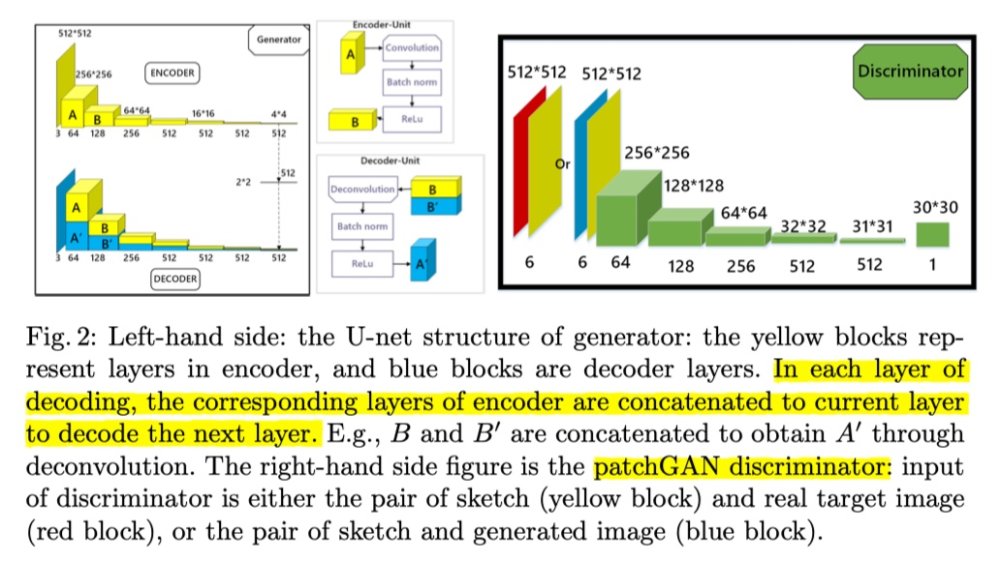

### Loss Function

The loss function ensures that the generated image contains both pixel level details of sketch as well as high-level information of painted colors:

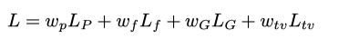

- L_G is the generative loss

- L_p is the pixel-level loss (the L1 distance between the generate image and the ground

  truth at pixel level)

- L_f is the feature loss (the L2 distance beteen outputs of the 4th layer of the VGG16 pre-trained on the ImageNet dataset)

- L_tv is the total variation loss (constrain the pixel changes in the generated results and encourages smoothness)

  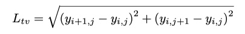

### Experimental Studies

#### Dataset

1. Training images are all resized to 512 × 512
2. Boundary detection filter XDoG to extract sketches

#### Evaluation Metrics & Results

1. Volunteers were presented with a series of painted images generated by different algorithms and asked to choose the best one and the worst one. Popularity index (based on the number of subjects who choose ‘like(dislike)’), for the i th picture generated by the j th algorithm:

   

   Result comparisons of the **pix2pix model, pix2pix +tv loss, pix2pix +feature loss and the auto-painter**:

   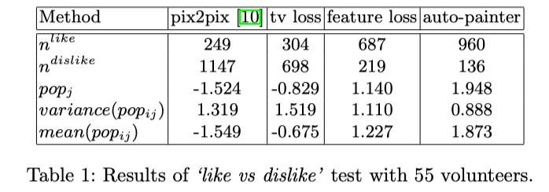

2. Visualization

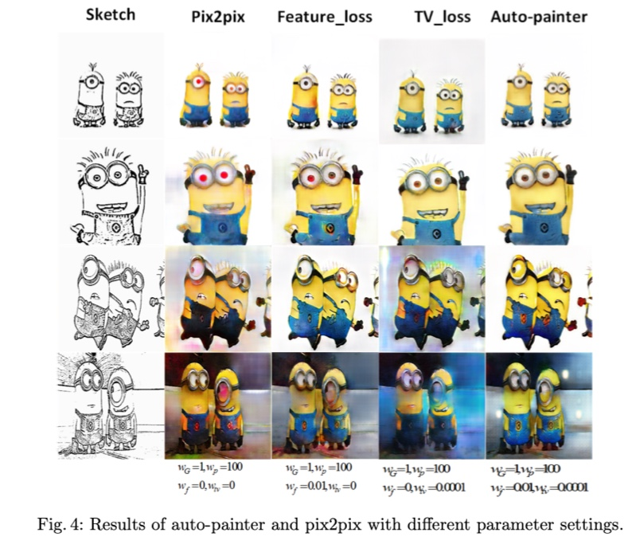

### Conclusion

1. U-net 的好处：

   Pure encoder-decoder network (the input goes through a series of down sampling steps to a lower dimension, then gets some non-liner transformation with a fully connected layer, and finally gets up sampling to the present output size) may cause information loss when passing through layers. **So ‘U-net’ , by concatenating layers in encoder to the corresponding layers of decoder, could maintain a certain degree of input sketch informaton and trained color painting information.**

2. 各种 loss 的作用：

   Compared with the Pix2pix model which has no feature loss and total variation (tv) loss, we could concluse that **without tv loss, the result images tend to dissolve to background and look messy（上图第三列和第五列）and without the feature loss, the details of result image become blurry（上图第四列和第五列）.**

------

## 2. Semantic Image Synthesis with Spatially-Adaptive Normalization

### Issue

- Synthesizing photorealistic images given an input semantic layout
- Traditioanl normalization layers tend to “wash away” semantic information

### Solution

- A new [conditional normalization](../Related Work/Conditional_Batch_Normalization.md) method called the SPatially-Adaptive (DE)normalization  (SPADE)

  
  
  相较于 BN 的 modulation parameters γ and β 作为权重通过损失学习得到，并且对于规范化后的normalized activation 各个位置进行相同的 scale 和 bias 等线性变换；SPADE 的  γ and β 通过一个预训练好的两层的 CNN 得到，保留了 segmentation mask m 的特征和空间相关性，得到和 normalized activation 有着一样的 shape，即每一个 （c,y,x）对应着不同的 γ and β，然后进行 element-wise 的操作。
  
  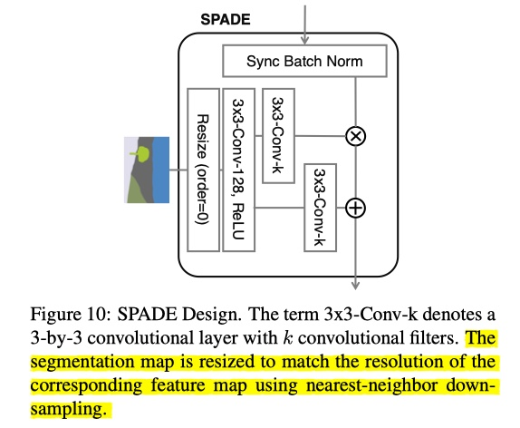
  
  具体公式：
  
  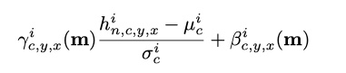
  
  （Let h_i denote the activations of the i-th layer of a deep convolutional network for a batch of N samples. Let C_i be the number of channels in the layer. Let H_i and W_i be the height and width of the activation map in the layer）
  
  其中 mean and standard deviation 采用 channel-wise 计算得到：
  
  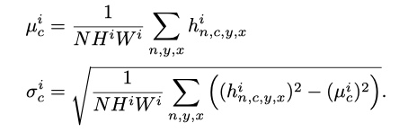
  
  

### Network Architecture

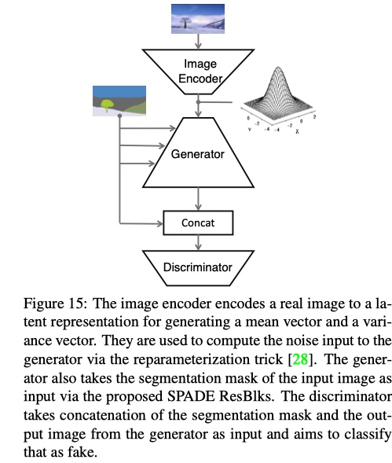

- Image encoder

  encoder 的作用是捕捉真实图片的 style，并得到服从高斯分布随机噪声的均值和方差。

  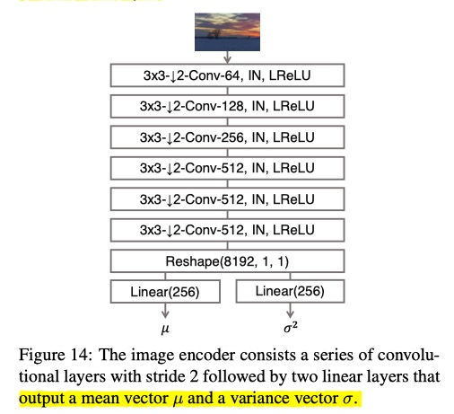

- SPADE generator

  丢弃了 encoder 的部分，直接从一个 random vector 作为输入，把 ResNet Blocks 的 BN 层换成 SPADE，然后 segmentation mask 经过不同的 downsample 

  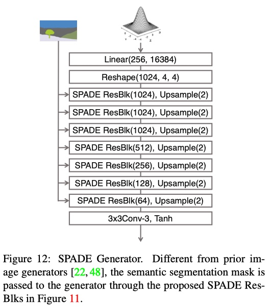

  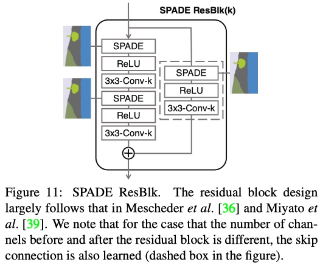

- Discriminator

  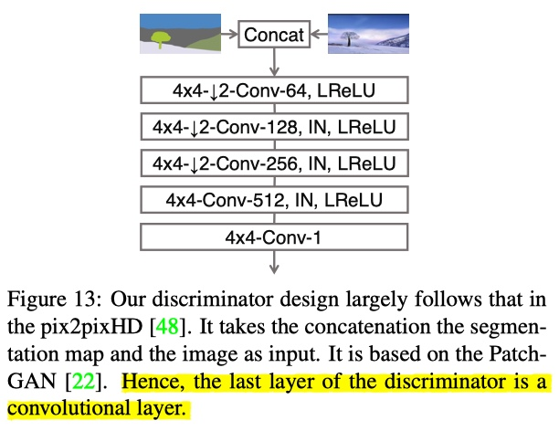

  

### Loss Function

- 训练 Image encoder 的损失是 KL Divergence loss：

  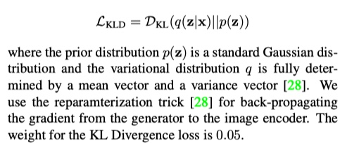

- 训练 generator 和 discriminator 的损失和 pix2pixHD 中的基本一样，除了 replace its LSGAN (Least Squares Generative Adversarial Networks) loss  term with the Hinge loss term

  [详见 GAN 中的不同 loss](../Related Work/Different_Loss_Functions_in_GAN.md)

### Experimental Studies

#### Dataset

- COCO-Stuff

- ADE20K

- ADE20K-outdoor

- Cityscapes

- Flickr Landscapes

  

#### Baselines

- pix2pixHD
- cascaded refinement network (CRN)
- semi-parametric image synthesis method (SIMS) 

Both the CRN and SIMS are mainly trained using image reconstruction loss

#### Evaluation Metrics & Results

1. Performance metrics

- mean Intersection-over-Union (mIoU)
- the pixel accuracy (accu)
- Fr´echet Inception Distance (FID)

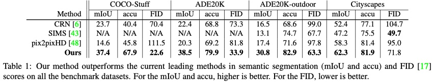

2. Visual comparison

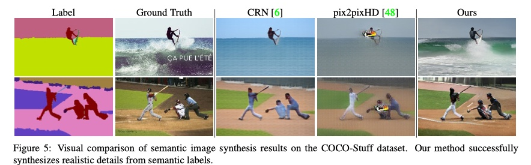

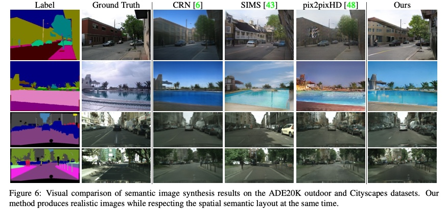

### Conclusion

1. 在不将 mask 作为条件输入到 generator 进行 encode 的情况下，可以通过 SPADE 进行约束，同样保留了 semantic 的信息，但是却减少了生成器的训练复杂度。

2. 比起 BN 或者 IN（InstanceNorm）会 wash away semantic information when applied to uniform or flat segmentation masks，比如对于一个只有一个 label 的 mask，由于 IN 根据单张 mask 进行规范化，所以造成规范化结果变为 0 的情况，对于较少的 label 情况也不容乐观。如下图

   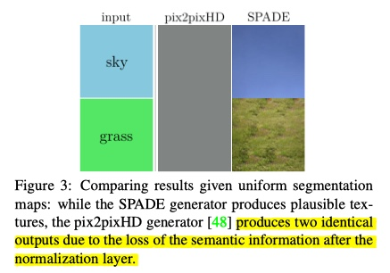

   所以 SPADE 可以在享受规范化带来的好处同时保留输入的语义信息

