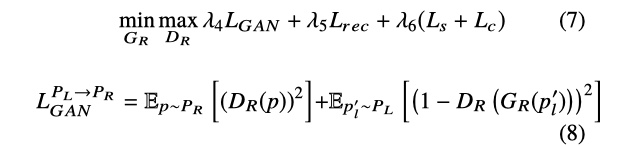
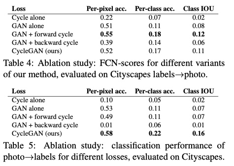

[1. An Unpaired Sketch-to-Photo Translation Model](#1-an-unpaired-sketch-to-photo-translation-model)

[2. Unpaired Image-to-Image Translation using Cycle-Consistent Adversarial Networks](#2-unpaired-image-to-image-translation-using-cycle-consistent-adversarial-networks)

------


## 1. An Unpaired Sketch-to-Photo Translation Model

### Issue

- Sketch-Based Image Synthesis (SBIS):

  1. sketches deform in shape
  2. various drawing styles, sketches could appear differently even they are corresponding to the same object
  3. sketches lack visual cues as they do not contain colors and most texture information

  

### Solution

- Disentangling shape and color translation, allowing the model to handle the task step by step:

  **The model first translates sketch to a grayscale photo, resolving shape distortion problem; then the generated grayscale photo is enriched with other visual information like colors.**

- Different from previous works which use attention module to emphasize particular regions in the original image, our proposed model is guided by the **learned attention mask to ignore (or pay less attention to) distracted regions.**

- A conditional module in color translation step, aiming to give users more control over final synthesized photos.


### Network Architecture

Mapping a sketch to a photo image involves changes in two aspects: shape and color; therefore, the proposed model consists of **two sub-networks,** each tackling the translation in one aspect.


#### Shape Translation Network

- translate a sketch image to a grayscale image
- based on CycleGAN


#### Colorization Network

- map the generated grayscale image G_L(s) to RGB photo domain
- encoder-decoder structure
- generated grayscale image is the content image, while the real photo is the reference image: more flexibility


### Loss Function

#### Shape Translation Network


- 两个 generator：G_L 和 F 的对抗损失；两个 discrimonator ：D_L 和 D_S 的对抗损失
- cycle 是重建损失
- identity loss


#### Colorization Network



- L_res: reconstruction loss （ GT 与生成的 RGB 图差的 L1 范数）
- L_c: content loss 
- L_s: style loss


### Experimental Studies

#### Dataset

- ShoeV2


#### Baselines

- CycleGAN
- UNIT
- MUNIT
- UGATIT
- Pix2Pix


#### Evaluation Metrics

- Human Preference
- Fréchet Inception Distance
- Learned Perceptual Image Patch Similarity


#### Quantitative and Qualitative Result


### Conclusion

The model's contribution:

1. The first unsupervised sketch-to-photo translation model (**without using paired data**) which can derive a photo from a human freehand sketch
2. Decomposing the SBIS task into a sequential translations of shape and color
3. Introducing two data augmentation strategies and re-purpose an attention module to handle drawing style problem (**robust to different styles of sketch input**)
4. A conditional module is adapted for color translation to improve diversity and increase users’ control over the generated results
5. Can also synthesize realistic sketches from photos inversely

------


## 2. Unpaired Image-to-Image Translation using Cycle-Consistent Adversarial Networks

### Issue

- Obtaining paired training data can be difficult and expensive in I2I translation
- Mode collapse: input images map to the same output image and the optimization fails to make progress


### Solution

- 2 translator cycle consistent: a translator G : X → Y and another translator F : Y → X, then G and F should be inverses of each other, and both mappings should be bijections


### Network Architecture


对于 (3, 256, 256) 的 image (inputgen)，generator 首先是 two stride-2 convolutions，然后通过 9 个resnet_blocks，最后是 two fractionally strided convolutions with stride 1/2。

```python
# https://github.com/leehomyc/cyclegan-1/model.py 
def build_generator_resnet_9blocks_tf(inputgen, name="generator", skip=False):
    with tf.variable_scope(name):
        f = 7
        ks = 3
        padding = "REFLECT"

        pad_input = tf.pad(inputgen, [[0, 0], [ks, ks], [
            ks, ks], [0, 0]], padding)
        o_c1 = layers.general_conv2d(
            pad_input, ngf, f, f, 1, 1, 0.02, name="c1")
        o_c2 = layers.general_conv2d(
            o_c1, ngf * 2, ks, ks, 2, 2, 0.02, "SAME", "c2")
        o_c3 = layers.general_conv2d(
            o_c2, ngf * 4, ks, ks, 2, 2, 0.02, "SAME", "c3")

        o_r1 = build_resnet_block(o_c3, ngf * 4, "r1", padding)
        o_r2 = build_resnet_block(o_r1, ngf * 4, "r2", padding)
        o_r3 = build_resnet_block(o_r2, ngf * 4, "r3", padding)
        o_r4 = build_resnet_block(o_r3, ngf * 4, "r4", padding)
        o_r5 = build_resnet_block(o_r4, ngf * 4, "r5", padding)
        o_r6 = build_resnet_block(o_r5, ngf * 4, "r6", padding)
        o_r7 = build_resnet_block(o_r6, ngf * 4, "r7", padding)
        o_r8 = build_resnet_block(o_r7, ngf * 4, "r8", padding)
        o_r9 = build_resnet_block(o_r8, ngf * 4, "r9", padding)

        o_c4 = layers.general_deconv2d(
            o_r9, [BATCH_SIZE, 128, 128, ngf * 2], ngf * 2, ks, ks, 2, 2, 0.02,
            "SAME", "c4")
        o_c5 = layers.general_deconv2d(
            o_c4, [BATCH_SIZE, 256, 256, ngf], ngf, ks, ks, 2, 2, 0.02,
            "SAME", "c5")
        o_c6 = layers.general_conv2d(o_c5, IMG_CHANNELS, f, f, 1, 1,
                                     0.02, "SAME", "c6",
                                     do_norm=False, do_relu=False)

        if skip is True:
            out_gen = tf.nn.tanh(inputgen + o_c6, "t1")
        else:
            out_gen = tf.nn.tanh(o_c6, "t1")

        return out_gen
```


Discriminator is 70 × 70 PatchGANs, which aim to classify whether 70 × 70 overlapping image patches are real or fake.

```python
# https://github.com/leehomyc/cyclegan-1/model.py 
def discriminator_tf(inputdisc, name="discriminator"):
    with tf.variable_scope(name):
        f = 4

        o_c1 = layers.general_conv2d(inputdisc, ndf, f, f, 2, 2,
                                     0.02, "SAME", "c1", do_norm=False,
                                     relufactor=0.2)
        o_c2 = layers.general_conv2d(o_c1, ndf * 2, f, f, 2, 2,
                                     0.02, "SAME", "c2", relufactor=0.2)
        o_c3 = layers.general_conv2d(o_c2, ndf * 4, f, f, 2, 2,
                                     0.02, "SAME", "c3", relufactor=0.2)
        o_c4 = layers.general_conv2d(o_c3, ndf * 8, f, f, 1, 1,
                                     0.02, "SAME", "c4", relufactor=0.2)
        o_c5 = layers.general_conv2d(
            o_c4, 1, f, f, 1, 1, 0.02,
            "SAME", "c5", do_norm=False, do_relu=False
        )

        return o_c5
```

使用 Instance norm 进行规范化，ReLu 作为激活函数。


### Loss Function

- **adversarial losses** for matching the distribution of generated images to the data distribution in the target domain

  For the mapping function G : X → Y and its discriminator D_Y , we express the objective as:

  

  G aims to minimize this objective against an adversary D that tries to maximize it.

  注意：

  **L_GAN , we replace the negative log likelihood objective by a least-squares loss. This loss is more stable during training and generates higher quality results.** 

  i.e. 

  

  


- **cycle consistency losses** to prevent the learned mappings G and F from contradicting each other

  

  [Implementation in Keras](https://github.com/leehomyc/cyclegan-1/blob/master/losses.py)

  引入 cycle consistency loss 的原因：（减少 mapping 的多样性）

  > However, with large enough capacity, a network can map the same set of input images to any random permutation of images in the target domain, where any of the learned mappings can induce an output distribution that matches the target distribution. **Thus, adversarial losses alone cannot guarantee that the learned function can map an individual input x_i to a desired output y_i .**
  
  不同 loss 对结果的影响见 [Ablation Study](#ablation-study)

​	

### Experimental Studies

#### Dataset

- semantic labels↔photo on the Cityscapes 
- map↔aerial photo on data scraped from Google Maps


#### Baselines

- CoGAN
- SimGAN
- Feature loss + GAN
- BiGAN/ALI
- pix2pix


#### Evaluation Metrics 

- AMT perceptual studies
- FCN score
- Semantic segmentation metrics


#### Qualitatively and Quantitatively Results


#### Ablation study





### Conclusion

- 可以用于无监督的 Image Translation，Style Transfer 

- 引入了一种 cycle consistency loss 保证生成的图片符合 target distribution 的同时与 source 图片有一对一的对应关系，而不是产生 mode collapse，即对于不同的输入，产生相同的输出

  