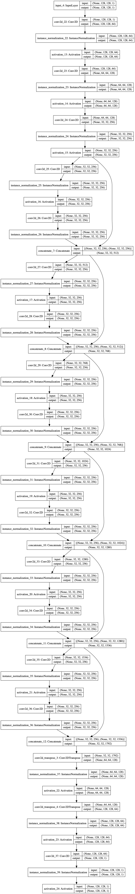

# CycleGAN Keras Implementation (Part 1)

## CycleGAN Architechture


- 2 translator, G: X -> Y, F: Y -> X
- 2 corresponding discriminator, Dy for predicting Y and Y^, Dx for predicting X and X^

------


## Generator

The CycleGAN Generator model takes an image as input and generates a translated image as output.

The model uses a sequence of downsampling convolutional blocks to encode the input image, a number of residual network ([ResNet](https://machinelearningmastery.com/how-to-implement-major-architecture-innovations-for-convolutional-neural-networks/)) convolutional blocks to transform the image, and a number of upsampling convolutional blocks to generate the output image.

Following the naming convention used in the [Johnson et al.’s Github repository,](https://github.com/jcjohnson/fast-neural-style) Let

- c7s1-k denote a 7×7 Convolution-InstanceNormReLU layer with k filters and stride 1
- dk denotes a 3 × 3 Convolution-InstanceNorm-ReLU layer with k filters and stride 2
- Rk denotes a residual block that contains two 3 × 3 convolutional layers with the same number of filters on both layer
- uk denotes a 3 × 3 fractional-strided-ConvolutionInstanceNorm-ReLU layer with k filters and stride 1/2

For the 128*128 input image, the architechture (consists of 6 residual blocks) is as follows:

c7s1-64,d128,d256,R256,R256,R256, R256,R256,R256,u128,u64,c7s1-1

Summary of the generator model

```python
__________________________________________________________________________________________________
Layer (type)                    Output Shape         Param #     Connected to                     
==================================================================================================
input_4 (InputLayer)            (None, 128, 128, 1)  0                                            
__________________________________________________________________________________________________
conv2d_22 (Conv2D)              (None, 128, 128, 64) 3200        input_4[0][0]                    
__________________________________________________________________________________________________
instance_normalization_22 (Inst (None, 128, 128, 64) 128         conv2d_22[0][0]                  
__________________________________________________________________________________________________
activation_13 (Activation)      (None, 128, 128, 64) 0           instance_normalization_22[0][0]  
__________________________________________________________________________________________________
conv2d_23 (Conv2D)              (None, 64, 64, 128)  73856       activation_13[0][0]              
__________________________________________________________________________________________________
instance_normalization_23 (Inst (None, 64, 64, 128)  256         conv2d_23[0][0]                  
__________________________________________________________________________________________________
activation_14 (Activation)      (None, 64, 64, 128)  0           instance_normalization_23[0][0]  
__________________________________________________________________________________________________
conv2d_24 (Conv2D)              (None, 32, 32, 256)  295168      activation_14[0][0]              
__________________________________________________________________________________________________
instance_normalization_24 (Inst (None, 32, 32, 256)  512         conv2d_24[0][0]                  
__________________________________________________________________________________________________
activation_15 (Activation)      (None, 32, 32, 256)  0           instance_normalization_24[0][0]  
__________________________________________________________________________________________________
conv2d_25 (Conv2D)              (None, 32, 32, 256)  590080      activation_15[0][0]              
__________________________________________________________________________________________________
instance_normalization_25 (Inst (None, 32, 32, 256)  512         conv2d_25[0][0]                  
__________________________________________________________________________________________________
activation_16 (Activation)      (None, 32, 32, 256)  0           instance_normalization_25[0][0]  
__________________________________________________________________________________________________
conv2d_26 (Conv2D)              (None, 32, 32, 256)  590080      activation_16[0][0]              
__________________________________________________________________________________________________
instance_normalization_26 (Inst (None, 32, 32, 256)  512         conv2d_26[0][0]                  
__________________________________________________________________________________________________
concatenate_7 (Concatenate)     (None, 32, 32, 512)  0           instance_normalization_26[0][0]  
                                                                 activation_15[0][0]              
__________________________________________________________________________________________________
conv2d_27 (Conv2D)              (None, 32, 32, 256)  1179904     concatenate_7[0][0]              
__________________________________________________________________________________________________
instance_normalization_27 (Inst (None, 32, 32, 256)  512         conv2d_27[0][0]                  
__________________________________________________________________________________________________
activation_17 (Activation)      (None, 32, 32, 256)  0           instance_normalization_27[0][0]  
__________________________________________________________________________________________________
conv2d_28 (Conv2D)              (None, 32, 32, 256)  590080      activation_17[0][0]              
__________________________________________________________________________________________________
instance_normalization_28 (Inst (None, 32, 32, 256)  512         conv2d_28[0][0]                  
__________________________________________________________________________________________________
concatenate_8 (Concatenate)     (None, 32, 32, 768)  0           instance_normalization_28[0][0]  
                                                                 concatenate_7[0][0]              
__________________________________________________________________________________________________
conv2d_29 (Conv2D)              (None, 32, 32, 256)  1769728     concatenate_8[0][0]              
__________________________________________________________________________________________________
instance_normalization_29 (Inst (None, 32, 32, 256)  512         conv2d_29[0][0]                  
__________________________________________________________________________________________________
activation_18 (Activation)      (None, 32, 32, 256)  0           instance_normalization_29[0][0]  
__________________________________________________________________________________________________
conv2d_30 (Conv2D)              (None, 32, 32, 256)  590080      activation_18[0][0]              
__________________________________________________________________________________________________
instance_normalization_30 (Inst (None, 32, 32, 256)  512         conv2d_30[0][0]                  
__________________________________________________________________________________________________
concatenate_9 (Concatenate)     (None, 32, 32, 1024) 0           instance_normalization_30[0][0]  
                                                                 concatenate_8[0][0]              
__________________________________________________________________________________________________
conv2d_31 (Conv2D)              (None, 32, 32, 256)  2359552     concatenate_9[0][0]              
__________________________________________________________________________________________________
instance_normalization_31 (Inst (None, 32, 32, 256)  512         conv2d_31[0][0]                  
__________________________________________________________________________________________________
activation_19 (Activation)      (None, 32, 32, 256)  0           instance_normalization_31[0][0]  
__________________________________________________________________________________________________
conv2d_32 (Conv2D)              (None, 32, 32, 256)  590080      activation_19[0][0]              
__________________________________________________________________________________________________
instance_normalization_32 (Inst (None, 32, 32, 256)  512         conv2d_32[0][0]                  
__________________________________________________________________________________________________
concatenate_10 (Concatenate)    (None, 32, 32, 1280) 0           instance_normalization_32[0][0]  
                                                                 concatenate_9[0][0]              
__________________________________________________________________________________________________
conv2d_33 (Conv2D)              (None, 32, 32, 256)  2949376     concatenate_10[0][0]             
__________________________________________________________________________________________________
instance_normalization_33 (Inst (None, 32, 32, 256)  512         conv2d_33[0][0]                  
__________________________________________________________________________________________________
activation_20 (Activation)      (None, 32, 32, 256)  0           instance_normalization_33[0][0]  
__________________________________________________________________________________________________
conv2d_34 (Conv2D)              (None, 32, 32, 256)  590080      activation_20[0][0]              
__________________________________________________________________________________________________
instance_normalization_34 (Inst (None, 32, 32, 256)  512         conv2d_34[0][0]                  
__________________________________________________________________________________________________
concatenate_11 (Concatenate)    (None, 32, 32, 1536) 0           instance_normalization_34[0][0]  
                                                                 concatenate_10[0][0]             
__________________________________________________________________________________________________
conv2d_35 (Conv2D)              (None, 32, 32, 256)  3539200     concatenate_11[0][0]             
__________________________________________________________________________________________________
instance_normalization_35 (Inst (None, 32, 32, 256)  512         conv2d_35[0][0]                  
__________________________________________________________________________________________________
activation_21 (Activation)      (None, 32, 32, 256)  0           instance_normalization_35[0][0]  
__________________________________________________________________________________________________
conv2d_36 (Conv2D)              (None, 32, 32, 256)  590080      activation_21[0][0]              
__________________________________________________________________________________________________
instance_normalization_36 (Inst (None, 32, 32, 256)  512         conv2d_36[0][0]                  
__________________________________________________________________________________________________
concatenate_12 (Concatenate)    (None, 32, 32, 1792) 0           instance_normalization_36[0][0]  
                                                                 concatenate_11[0][0]             
__________________________________________________________________________________________________
conv2d_transpose_3 (Conv2DTrans (None, 64, 64, 128)  2064512     concatenate_12[0][0]             
__________________________________________________________________________________________________
instance_normalization_37 (Inst (None, 64, 64, 128)  256         conv2d_transpose_3[0][0]         
__________________________________________________________________________________________________
activation_22 (Activation)      (None, 64, 64, 128)  0           instance_normalization_37[0][0]  
__________________________________________________________________________________________________
conv2d_transpose_4 (Conv2DTrans (None, 128, 128, 64) 73792       activation_22[0][0]              
__________________________________________________________________________________________________
instance_normalization_38 (Inst (None, 128, 128	, 64) 128         conv2d_transpose_4[0][0]         
__________________________________________________________________________________________________
activation_23 (Activation)      (None, 128, 128, 64) 0           instance_normalization_38[0][0]  
__________________________________________________________________________________________________
conv2d_37 (Conv2D)              (None, 128, 128, 1)  3137        activation_23[0][0]              
__________________________________________________________________________________________________
instance_normalization_39 (Inst (None, 128, 128, 1)  2           conv2d_37[0][0]                  
__________________________________________________________________________________________________
activation_24 (Activation)      (None, 128, 128, 1)  0           instance_normalization_39[0][0]  
==================================================================================================
Total params: 18,449,411
Trainable params: 18,449,411
Non-trainable params: 0
__________________________________________________________________________________________________
```

The plot of the generator model is also created, showing the skip connections in the ResNet blocks.



------


## Discriminator

The discriminator model is responsible for taking a real or generated image as input and predicting whether it is real or fake.

The discriminator model is implemented as a 70 × 70 PatchGANs model, which aim to classify whether 70 × 70 overlapping image patches are real or fake. Instead of outputting a single value like a traditional discriminator model, the PatchGAN discriminator model can output a square or one-channel feature map of predictions. The 70×70 refers to the effective receptive field of the model on the input, not the actual shape of the output feature map. The receptive field of a convolutional layer refers to the number of pixels that one output of the layer maps to in the input to the layer. 

Accordingly, Let

- Ck denote a 4 × 4 Convolution-InstanceNorm-LeakyReLU layer with k filters and stride 2.

The architecture for the discriminator is as follows:

C64-C128-C256-C512

**Specificlly, using leaky ReLUs with a slope of 0.2 for the first C64 layer, instead of using InstanceNorm. Note that the final hidden layer C512 is with a [1×1 stride](https://machinelearningmastery.com/padding-and-stride-for-convolutional-neural-networks/), and an output layer C1, also with a 1×1 stride.**

For the 128×128 images were used as input, then the size of the output feature map of activations would be 16×16.

Summary of the discriminator model

```python
_________________________________________________________________
Layer (type)                 Output Shape              Param #   
=================================================================
input_1 (InputLayer)         (None, 128, 128, 1)       0         
_________________________________________________________________
conv2d_1 (Conv2D)            (None, 64, 64, 64)        1088      
_________________________________________________________________
leaky_re_lu_1 (LeakyReLU)    (None, 64, 64, 64)        0         
_________________________________________________________________
conv2d_2 (Conv2D)            (None, 32, 32, 128)       131200    
_________________________________________________________________
instance_normalization_1 (In (None, 32, 32, 128)       256       
_________________________________________________________________
leaky_re_lu_2 (LeakyReLU)    (None, 32, 32, 128)       0         
_________________________________________________________________
conv2d_3 (Conv2D)            (None, 16, 16, 256)       524544    
_________________________________________________________________
instance_normalization_2 (In (None, 16, 16, 256)       512       
_________________________________________________________________
leaky_re_lu_3 (LeakyReLU)    (None, 16, 16, 256)       0         
_________________________________________________________________
conv2d_4 (Conv2D)            (None, 16, 16, 512)       2097664   
_________________________________________________________________
instance_normalization_3 (In (None, 16, 16, 512)       1024      
_________________________________________________________________
leaky_re_lu_4 (LeakyReLU)    (None, 16, 16, 512)       0         
_________________________________________________________________
conv2d_5 (Conv2D)            (None, 16, 16, 1)         8193      
=================================================================
Total params: 2,764,481
Trainable params: 2,764,481
Non-trainable params: 0
```


------


## Composite Models 

The generator models are not updated directly. Instead, the generator models are updated via composite models. A composite model is required for each generator model that is responsible for only updating the weights of that generator model, although it is required to share the weights with the related discriminator model and the other generator model. This can be achieved by marking the weights of the other models as not trainable in the context of the composite model to ensure we are only updating the intended generator.

We can define two composite models to train the two generator models respectively via adversarial and cycle loss.

**Generator-G Composite Model**

Only Generator-G weights are trainable and weights for other models and not trainable.

- **Adversarial Loss**: Domain-X -> Generator-G -> Domain-Y -> Discriminator-Y -> [real/fake]

  > *we replace the negative log likelihood objective by a least-squares loss. This loss is more stable during training and generates higher quality results.*
  >
  > — [Unpaired Image-to-Image Translation using Cycle-Consistent Adversarial Networks](https://arxiv.org/abs/1703.10593), 2017.

- **Forward Cycle Loss**: Domain-X -> Generator-G -> Domain-Y -> Generator-F -> Domain-X

- **Backward Cycle Loss**: Domain-Y -> Generator-F -> Domain-X -> Generator-G -> Domain-Y

  The adversarial loss defines here is L2 or mean square loss, while the forward and backward cycle loss are L1 or mean alsolute loss

  

**Generator-F Composite Model**

Only Generator-F weights are trainable and weights for other models and not trainable.

- **Adversarial Loss**: Domain-Y -> Generator-F -> Domain-X -> Discriminator-X -> [real/fake]
- **Forward Cycle Loss**: Domain-Y -> Generator-F -> Domain-X -> Generator-G -> Domain-Y
- **Backward Cycle Loss**: Domain-X -> Generator-G -> Domain-Y -> Generator-F -> Domain-X


**Instead of defining two composite model to train two generators respectively, I combined them into only one model which takes two real images in different domains as input and outputs the two different discriminator classification results, two reconstructed images to compute forward & backward cycle-consistency.**

Summary of the composite model

```python
__________________________________________________________________________________________________
Layer (type)                    Output Shape         Param #     Connected to                     
==================================================================================================
input_42 (InputLayer)           (None, 128, 128, 1)  0                                            
__________________________________________________________________________________________________
input_43 (InputLayer)           (None, 128, 128, 1)  0                                            
__________________________________________________________________________________________________
G (Model)                       (None, 128, 128, 1)  18449411    input_42[0][0]                   
                                                                 F[1][0]                          
__________________________________________________________________________________________________
F (Model)                       (None, 128, 128, 1)  18449411    input_43[0][0]                   
                                                                 G[1][0]                          
__________________________________________________________________________________________________
D_y (Model)                     (None, 16, 16, 1)    2764481     G[1][0]                          
__________________________________________________________________________________________________
D_x (Model)                     (None, 16, 16, 1)    2764481     F[1][0]                          
==================================================================================================
Total params: 42,427,784
Trainable params: 36,898,822
Non-trainable params: 5,528,962
```


------

