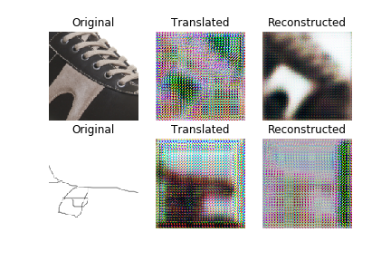

# CycleGAN Keras Implementation (Part 2)

## Train

In order to update discriminator and generator models, we can define a funciton named train() that takes an instance of each of the defined models and a loaded dataset (list of two NumPy arrays, one for each domain) and trains the model. 

A batch size of 1 is used as is described in the paper and the models are fit for 100 training epochs.

Firstly, define the Adversarial loss ground truths, the shape should follow the PatchGAN output.

```
 valid = np.ones((self.batch_size,) + self.patch_shape)
 fake = np.zeros((self.batch_size,) + self.patch_shape)
```

Then we can implement the training process to update model weights in each training iteration.

```python
for epoch in range(self.epochs):
  for batch_i, (imgs_X, imgs_Y) in enumerate(self.load_data()):

    # ----------------------
    #  Train Discriminators
    # ----------------------

    fake_Y = self.G.predict(imgs_X)
    fake_X = self.F.predict(imgs_Y)

    dY_loss_real = self.D_y.train_on_batch(imgs_Y, valid)
    dY_loss_fake = self.D_y.train_on_batch(fake_Y, fake)
    dY_loss = np.add(dY_loss_real, dY_loss_fake) 

    dX_loss_real = self.D_x.train_on_batch(imgs_X, valid)
    dX_loss_fake = self.D_x.train_on_batch(fake_X, fake)
    dX_loss = np.add(dX_loss_real, dX_loss_fake) 

    # Total disciminator loss
    d_loss = 0.5 * np.add(dY_loss, dX_loss)


    # ------------------
    #  Train Generators
    # ------------------

    g_loss = self.Composite.train_on_batch([imgs_X, imgs_Y],
                                           [valid, valid, imgs_X, imgs_Y])
```

Finally, we can plot the progress in terms of different losses.

```python
# Plot the progress
print ("[Epoch %d/%d] [Batch %d/%d] [D loss: %f] [G loss: %05f, adversarial: %05f, reconstr: %05f] time: %s " \
% ( epoch, self.epochs,
batch_i, self.n_batches,
d_loss,
g_loss[0],
np.mean(g_loss[1:3]),
np.mean(g_loss[3:5]),
elapsed_time))
```

## Test

During the process, we can save generated image samples according to the save interval.

```python
if batch_i % self.save_interval == 0:
	self.sample_images(epoch, batch_i)
```

After 100 iterations. (100 images in the 1st epoch)



